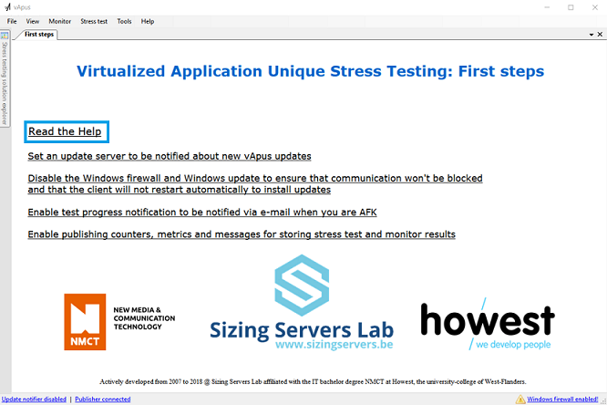

# vApus

<https://www.nmct.be> - <https://www.sizingservers.be> - <https://www.howest.be/en> - <https://www.linkedin.com/in/dietervandroemme>

The vApus stress testing framework is mostly build for testing web services while mimicking real users (a user browses to the homepage, logs in,...).
Because vApus is a framework it is possible to test any application that has a server socket (in theory) e.g. MySQL, Elasticsearch, ...

It is comparable to Apache JMeter for web stress testing (but with less efficient http sockets and by far more stress test useful results) and is the result of +/- 8 years active development and +/- 3 years maintenance by one person, Dieter Vandroemme, for the majority of the work.

Since the project is finished and that person left, Sizing Servers Lab decided to give away this software and all possible documentation for free.

Even though the software starts to show its age (it contains brilliant and also somewhat less brilliant code) it is still very usable for web stress testing, amongst others.

Do read on and enjoy this gift.

---

Stress testing is more complex than just pressing the Go button. Therefore some documentation is in place: See the Help folder in Build and / or install vApus using **Setup_vApus-2.4.2.exe**.

For specific questions, you can try to e-mail info@sizingservers.be. Keep in mind that support is not guaranteed, since active development is halted.

In the help folder:
* **vApus stress testing intro 201802** gives a good basic overview about how to stress test with vApus and analyze the results.
* Sizing Servers Lab builds, in the same folder, for the last stable vApus (and tools) + monitors.
* **README** contains a technical overview of the vApus source code.
* An example **version.ini**: a version .ini is generated using a Jenkins build job using history.xml in the sources and listing file hashes for version control.
* **Jenkins 2.88 build jobs** for vApus, monitors and others, but only stable git branches, to illustrate how Sizing Servers implemented continuous integration

The vApus stress testing suite consists out of a few different git repositories. You can find them all here on GitHub.

See the installation folder / the Build folder for an example.

Furthermore, you can do anything you like with the software in respect to the MIT license.

Hereunder a technical manual.

# Technical manual

## Preface
This is a short manual to guide you through the vApus Visual Studio solution.

It assumes that you know what vApus is (See the Help folder / Help in vApus, not yet available). This manual is not intended to explain each piece of code in detail, it is more of a guide to see the large picture.

If you want more details, you can look at the code that is fairly well structured and commented. In fact, it is recommended doing this while reading this manual.

vApus builds using .Net 4.7/Visual Studio 2017 and runs only on a 64 bit Windows. Builds are is automated using Jenkins.

If building yourself, please note that for vApus as a whole to work It needs to have the tools and other builds in its own build folder (ConnectionProxies, DetailedResultsViewer, Lupus-Titanium, MonitorSourceClients, PublishItemsHandler and ScnerioRuleSets).

Take a look at the folder structure of an installed vApus (Setup_vApus-2.4.2.exe) and the Jenkins build job exports in vApus.Gui/Help.

## vApus Stress testing Solution (vass) Framework
vApus is a stress testing framework for the user (more on that later), but it is also a framework for the developer.
The vass framework contains all functionality to save, load and displaying vass files and the objects within; Meaning that large parts of the GUI are auto-generated.
Most of the code that does this can be found in **vApus.SolutionTree**.

            Solution
                |
        SolutionComponent
        |        |
    BaseProject  |
                 |
               BaseItem 
                 |
    LabeledBaseItem

The code that glues the load and save functionality sits in the Solution class, that functionality is used in *vApus.Gui.MainWindow*. A Solution contains projects like *vApus.StressTests.StressTestProject*; projects contain items where the label can be editted in the treeview at the left, if it is a LabeledBaseItem. StressTestingSolutionExplorer generates nodes for a project or an item and adds them to its tree view, if the ShowInGui property equals true.

If you activate a node and you've added the ContextMenu and/or HotKeys class attribute to a class deep inheriting SolutionComponent a view will be shown for you: either an auto-generated one or a custom one that inherits from BaseSolutionComponentView. Feel free to browse the SolutionComponentView folder.

Example:

        [ContextMenu(new[] { "Activate_Click", "Remove_Click", "Copy_Click", "Cut_Click", "Duplicate_Click" },
                 new[] { "Edit", "Remove", "Copy", "Cut", "Duplicate" })]
        [Hotkeys(new[] { "Activate_Click", "Remove_Click", "Copy_Click", "Cut_Click", "Duplicate_Click" },
             new[] { Keys.Enter, Keys.Delete, (Keys.Control | Keys.C), (Keys.Control | Keys.X), (Keys.Control | Keys.D) })]

StressTestingSolutionExplorer and solution component views are displayed using WeifenLuo.WinFormsUI: Mdi childs are displayed as tabs, close to how Visual Studio does it.

To avoid circular dependencies different visual studio projects are registered in *vApus.Linker.Link*. SocketListenerLinker does that for a static *vApus.DistributedTesting.SocketListener*.

## Stress testing framework 

### Stress test
A stress test brings a connection and a one or more scenarios together; various other settings can be made to the test. At the back-end we have StressTestCore that uses the connection, the scenario(s) and the settings to execute the test.
For instance: a ConnectionProxyPool is filled, worker threads are added to the StressTestThreadPool (simulated users), the test is executed with action distribution taken into account,... (I chose to make my own -super lightweight, single purpose- ThreadPool because that is one I can control unlike the CLR ThreadPool)

Various hooks are in the core to be able to handle distributed test settings.

At the front-end we have a Configure panel, a Stress Test panel and a Detailed Results panel. The Stress Test panel shows the fast results which are metrics coming from *vApus.Results*, which also holds all results being, at hart, requests + sent at + time to last byte + error if  any + meta if any. Those metrics are cached so they do not need to be recalculated every time.
Local monitoring comes from *vApus.Monitor.LocalMonitor* and status messages are added to the *vApus.Util.EventPanel* using AddEvent.

You can choose to save the results to a MySQL database. Storing results is completely decoupled: they are published (pushed over a TCP connection) to an instance of vApus.PublishItemsHandler who does the expensive MySQL storing for you. You can implement your own handler if you like (e.g. storing in postgresql, visualizing monitor metrics). The options dialog tells you how published messages look like so you can deserialize them easily (JSON).

There are also some functions available to get formatted results like User Action Composition, which can be viewed on the Detailed Results tab page / Detailed Results Viewer. Here results can be exported to an Excel file which is styled like a report and contains charts. SpreadsheetLight ([spreadsheetlight.com](http://spreadsheetlight.com)) is used to do this: no com calls (way faster and less error prone) and well documented.

#### Connection
The code for this can be found in *vApus.StressTest.Connections*. If you create a new vass in vApus you can import a ConnectionProxy that was preinstalled with vApus; if you want to look around in it.

A connection is a configuration file that uses a ConnectionProxy to be able to format the given connection string (ConnectionProxyRuleSet) and to be able to connect and communicate to the server app (ConnectionProxyCode).
The most important function in a ConnectionProxyCode is SendAndReceive; this function is used in StressTestCore by simulated users / threads for each request in the used scenario(represented as StringTrees).

For debugging ConnectionProxyCode you can call EventPanel.AddEvent(string message), this will add an event to all EventPanel instances in vApus. You can use a preprocessor (for instance: #define DEBUGMODE) and encapsulate the call between #if and #endif to easily set the 'debug mode'. Note: do not use this in a real test. The main thread/GUI thread will be a bottleneck.

When starting a test a ConnectionProxyCode is compiled using *vApus.Util.CompilerUnit* with the v4.0 option (.Net version, this is the same option for 4.6 which is a drop in replacement for 4.0). Note that the ConnectionProxyCode implements IConnectionProxy; the compiled class is casted to this because it is easier and probably more performant to do direct function calls instead of using reflection.

The main control at the front-end is a FastColoredTextbox, which is fantastic (thanks to Pavel Torgashov <http://www.codeproject.com/Articles/161871/Fast-Colored-TextBox-for-syntax-highlighting>). Otherwise no notable controls.

#### Scenario
The code for this can be found in *vApus.StressTest.Scenarios*. If you create a new vass in vApus you can import a ScenarioRuleSet that was preinstalled with vApus; if you want to look around in it.

A scenario consists out of user actions, those user actions contain requests. If we look at a web app a user action can be seen as a web page load containing all requests associated with that page (html, js, css, banana,...). HTTP(S) requests can be captured from within vApus, Lupus-Titanium is used for that. The lupus-fiddler project can be found in Git.

How requests should look like is defined in a ScenarioRuleSet, this is important for the ConnectionProxyCode to be able to get and use the different pieces of the requests.

Requests are lexed to StringTrees (AN abstract syntax tree implementation) when starting a stress tests taking the rule set into account; a StringTree is a representation of that requests and the different parts can be asked by using indexing and the property Value for leaf nodes or the function CombineValues().

The front-end holds functionality to be able to view and edit requests, add user actions, find and replace, ... various settings can be made also, like pinning user actions or using delay between user actions. Parameter tokens (representation of a parameter) can be placed in requests, a list of all available parameters can be shown if you click the button.

##### Parameters 
The code for this can be found in *vApus.StressTest.Parameters*.

Requests can be parameterized to for instance fill in a unique user name for a simulated user in a stress test. Various flavors are available, the most performant of them is CustomList.
Parameter values are determined in StressTestCore right before a stress test starts, those values are put in a lexed request (StringTree). A few scopes are available for when a next value for a parameter should be calculated.
Take a look at *vApus.StressTest.Scenarios.Scenario.GetParameterStructure()* to see how this works.

When the build in parameters are not sufficient, for instance when you need a value from a response in a following request, you can use a system that is adopted by the current users of vApus:
* You store the value that you need in a field in the connection proxy (each simulated user has an instance, use a static field if need be).
* In the request you replace the piece of text that you want to parameterize by {_foo} (Foo being a nice label. Note that it is formatted as a regular parameter with the field name between the brackets: most handy way to use ).
* Add code that replaces {_foo} with the needed value when stress testing (a conditional check will probably be needed).

##### Value store 
The value store enables sharing data in a thread safe manner between threads in a stress test. Useful when doing a test with parallel requests: when simulating a browser static content (js, css, images) is requested in parallel threads [[LINK WEB BROWSER STUDY]]. Since cookies need to be set correctly on all requests (implemented in a default HTTP(S) connection proxy) or we need a value from a javascript for later use or... we can use this Value store.

Usage instructions in connection proxy code as in vApus:

  Get, or add if it does not yet exists, a ValueStoreValue. Use the label of the ValueStoreValue as variable name.
  Added values from the CP will not be visible on the GUI and are not added to the vApus solution file.
  
        ValueStoreValue _myValue = ValueStore.GetOrAdd(Value store value label e.g. "myValue"object defaultValue = null, bool isUniqueForEachConnection = true, bool publish = false);
  
  If values hold 'objects', an empty default value will be an empty string (not 'null').
  CP added values are always from the type 'object' and are always cleared before a test.
  
        var defaultValue = _myValue.DefaultValue;
  
  Respect the chosen type, otherwise setting a value will fail.
  If the value must be unique for each connection, this call will only work in SendAndReceive(...) and sub functions.
  If not, this will work in every function (e.g. TestConnection(out error)).
  
        _myValue.Set("foobar");
  
  or (If not unique, the given owner will be ignored. Be careful when using this, dicussed further)
  
        _myValue.Set(owner e.g. "vApus Thread Pool Thread #1", "foobar");
  
  You can get the names of the threads who set a value.
  'shared' (without quotes) is returned when not unique for each connection.
  
        string[] owners = _myValue.GetOwners();
  
  Get the 'shared' value or the value set for the current connection or for a chosen one (owner).
  This value can be used to replace a token (a piece of text for instance "{myValue}") in the request, coming through SendAndReceive(...).
  e.g. If Type is String:
  
        string foo = _myValue.Get<string>();
        string bar = _myValue.Get<string>(owner e.g. "vApus Thread Pool Thread #1");
  
  e.g. If Type is Object: 
  
        object foo = _myValue.Get();
  
  Fetching data from another owner can be very handy when you are using parallel requests in your test.
  e.g. you can set the value in the CP for the 'simulated user thread' and request that data in the 'parallel request threads' (who have their own CP object):
  
        if(Thread.CurrentThread.GetParent() == null) {
          // I am a 'simulated user thread'.
          _myValue.Set("foobar");
        }
        string owner = Thread.CurrentThread.GetParent() as string;
        if (owner == null) {
          // I am a 'simulated user thread'.
          owner = Thread.CurrentThread.Name;
        } // else I am a 'parallel request thread'.
        EventPanel.AddEvent(string.Empty + _myValue.Get<object>(owner));

### Distributed test
The code for this can be found in *vApus.DistributedTesting*.

        DistributedTest
        |            |
      Tiles        Clients 
        |            |
      Tile         Client
        |            |
    TileStressTest  Slave

The regular stress tests in a vass serves as building blocks for a distributed test. TileStressTest proprerties are automatically defaulted to a chosen stress test, you can choose to switch this functionality off. You must have regular stress tests before you can make a distributed test. (It is designed like this because it is easier to see if a stress test actually works running it locally and it is easier to wrap your mind around the whole stress testing thing like this. When adding stress tests, connections, r to the vass, keep Tiles in mind (see further).)

The general idea is that a workload can be offloaded to different clients with vApus slaves, they report back to the vApus master.

A workload can be defined as different stress tests for the different parts of a (virtual) stack (Tile), for example a database server and two load balanced web servers. This is called many-to-many testing.
It can also be the load for one stress tests spread over more than one slave, preferably on different clients, if one client is not able to handle the test. This is called many-to-one testing. Both types can be mixed in a distributed test.
You can assign a TileStressTest to multiple slaves in its configuration panel.

To keep TileStressTest runs in sync we have two flavours: Break on First Run Finished and Break on Last Run Finished (loops runs for the other tests until then). Look at the code in *DistributedTestCore* and *vApus.StressTest.StressTestCore* and search for RunSynchronization to have a better understanding of this.

Now you understand that TileStressTests run more or less like a regular stress test on a slave, differences are stated above, in fact a TileStressTest is parsed to a StressTest which is sent to a slave. The Gui is stripped (TileStressTestView), results can still be reported to a result db like for a regular test.

The front-end is much like the front-end for a regular stress test, there are a few notable extras though: 
* The Wizard (re)builds a distributed test for you and is shown automatically when opening an empty distributed test. It looks at the regular stress tests in the vass to build TileStressTests and order them in a Tile.

* A Remote Desktop Client: *vApus.Jumpstart* (see Tools) will only work if a user session (remote or local) is running on a test client. You can choose if you want vApus to connect via remote desktop to the client if you like.
### Monitor
The code for this can be found in *vApus.Monitor*.

A monitor gathers hardware metrics from a remote server or machine using the vApus Monitor Sources binaries (vApus.Monitor.Sources repo).
vApus.Monitor.Sources.Base.dll must reside in the ./Prerequisites/vApus.Monitor.Sources folder; those dlls are used as a base for the 'monitor sources' that must be found in the MonitorSourceClients folder in the build folder of vApus. The 'nightly' or 'stable' Jenkins job automate this for you.

A 'monitor source' holds functionality to get the hardware configuration from a machine and the possible counters that can be requested. Different monitor sources are available, for instance: Windows, ESXi, Racktivity, ...

The Windows monitor source communicates to an agent installed on the server, this is also the case with for instance the dstat agent and others.

Monitor metrics can run together with a stress test or distributed test.

## Tools
* vApus.CommitTool
Used in a Jenkins job, sends the binaries to vapusupdate.sizingservers.be.

* vApus.DetailedResultsViewer
A seperate tool a user can use to review stress testing results, accessible through the main menu and via a Detailed Results tab.

* vApus.JumpStart
Used for jump starting / smart updating slaves for a distributed test.

* vApus.KillvApusAndTools
Used when updating / (un)installing vApus. You can use this yourself if you like.

* vApus.Monitor.Sources
Part of the monitoring framework. Enables communication with the monitor agents.

* vApus.PublishItemsHandler
Enables decoupling stress test result storing to MySQL. You can write your own handler if you like. See the options dialog for instructions.

* vApus.UpdateTool
Can be configured trough the options found in the vApus main menu. The user is automatically notified when there is an update available.

* vApus.Util
Holds different handy classes that are not vs project specific and thus can be used everywhere in the vs solution.

* SizingServers.IPC, SizingServers.Log, SizingServers.Util
Three pet projects donated to SizingServers used in vApus and tools

# Know issues
Following issues/bugs are known, but will most probably not be fixed because of lack of time.

* Minor flickering when doing something on the GUI when there are a lot of tabs (Mdi childs) open 

* Do not use parallel requests for web stress tests. Web tests will work just fine without this (only a bit less realistic).

Parallel requests in a single stress test do not work well (simulating web browsers)  
If too many threads are created thread contention will occur. In the current implementation this can be the case quite rapidly: Before each test run the thread pool is initialized for the 'Main User threads' and the 'Parallel request threads' as well.

By default, there are 6 static content requests (img, js, css) that are fetched in parallel (the 'Main user thread' + 5 'Parallel Request threads'). 'Parallel Request threads' are not reused in vApus, meaning that for each group of statics to be fetched in parallel 5 'Parallel Request threads' are created.

This is highly inefficient since even when idle the OS needs to schedule them. Because of lack of time this approach was chosen, tested, found valid, and bit us in the ass in a stress testing case for a client.

Possible workaround: Make a homogeneous distributed test with slaves on the same test client. This will work since .Net threads are scheduled per process. Ideally, we should have this built into vApus that it does this automatically.

Parallel requests in a distributed homogeneous test over different test clients do not work   
Only for tests with parallel requests the time right before sending a request is taken into account to calculate user action response times (how long it takes to get the html and all statics for a certain web page).

To determine this start time the TSC Invariant kernel function GetSystemTimePreciseAsFileTime is used ([[Running_vApus_virtualized]]), which works fine. However, time skew between the different test clients clocks in a homogeneous distributed test is not taken into account. Furthermore, we have to deal with network latency.

This renders 'Parallel Request testing' completely useless in this setup.

* When removing a slave that is assigned to a tile stress test from the 'Slaves tab page' on the Distributed Test GUI it is not update on the 'Configure tab page'

* Break on first distributed testing fails sometimes  
Is reproducible, but not easily fixed. The master-slaves communication layer should be rewritten.

# Running vApus virtualized

## Introduction
Running time-sensitive software virtualized is problematic, since measured time on a VM can skew from the wall-clock time. Especially if the underlying hardware is under heavy load.

Luckily there is a solution, for a virtualized Windows that is. (I did not research Linux solutions)

In the first chapter I tell you what you must do to run vApus virtualized without explaining anything. Next I give pointers to proof and to more details
that this approach works (according to the Internet).

This, however, is not yet tested. We must run a vApus physical and virtualized and cross-reference stress test results and behavior to check if they are equal to one-another. And this under heavy load, for example ASAP, high concurrency, distributed with a lot of slaves,...

Documented details are about virtualising using VMware software. Running on Xen or Hyper-V should not be a problem since the TSC Invariant MSR is available through the Hypervisor ([1][1], [2][2]).

# Practical

The VM must be a Windows 8.1 or a Windows Server 2012 or newer.

Download CoreInfo from [SysInternals][3] and run it from cmd on the VM (Administrator rights required).

The Machine Specific Register [TSC-INVARIANT][4] must be available (A * means available). Make sure that you’ve installed the VM''...''tools (vmware tools for example).

Install vApus and happy testing.

## In depth

### Windows

From Microsecond Resolution Time Services for [Windows][5] and confirmed by [Microsoft][6]:

<blockquote>''Windows 8.1 goes back to the roots; it goes back to 156250. The TSC frequency is calibrated against HPET periods to finally get proper timekeeping.''
</blockquote>

And

<blockquote>''Since Windows 7, the operating system runs tests on the underlying hardware to see which hardware is best used for timekeeping. When the processors Time Stamp Counter (TSC) is suitable, the operating system uses the TSC for timekeeping. If the TSC cannot be used for timekeeping the operating system reverts to the High Precision Event Timer (HPET). If that does not exist it reverts to the ACPI PM timer. For performance reasons it shall be noted that HPET and ACPI PM timer cause IPC overhead, while the use of the TSC does not. The evolution of TSC shows a variety of capabilities:

* Constant: The TSC does not change with CPU frequency changes, however it does change on C state transitions.
* Invariant: The TSC increments at a constant rate in all ACPI P-, C- and T-states.
* Nonstop: The TSC has the properties of both Constant and Invariant TSC''
</blockquote>

This means that the Stopwatch class used for time measurements in vApus ’s Connection Proxies, when vApus runs on Windows 7 / 8 can be correct and on =&gt; Windows 8.1, always work.

The Stopwatch class uses the QueryPerformanceCounter win32 API function internally. QPC uses TSC if the [TSC-INVARIANT MSR][6] (Machine Specific Register) is available, or falls back to HPET or PM timer (outdated, slower and not correct on VMs obviously).

If we need more precision we can use the GetSystemTimePreciseAsFileTime function on [Windows 8.1][5]. But I think that the Stopwatch class should be precise enough. This depends on the [hardware][7].

<blockquote>''Windows 8 introduces the function GetSystemTimePreciseAsFileTime() “with the highest possible level of precision (&lt;1us)”. This seems the counterpart to the linux gettimeofday() function.''
</blockquote>

### (Virtualized) Hardware

From [Microsoft][6]:

<blockquote>…you can determine whether your processor has an invariant TSC by using one of these: the Coreinfo.exe utility from Windows Sysinternals checking the values returned by the CPUID instruction pertaining to the TSC characteristics the processor manufacturer’s documentation The following shows the **TSC-INVARIANT** info that is provided by the Windows Sysinternals Coreinfo.exe utility (www.sysinternals.com). An asterisk means “True”.
</blockquote>
The TSC-INVARIANT MSR (a hardware counter for CPUs) must be available. This must be supported by the used virualisation software<ref name="GetSystemTimePreciseAsFileTime on pre-Windows 8" />. Presumably you must have the VM''...''tools installed for correct virtualization.

Check if TSC-INVARIANT is available using [CoreInfo][8].

[1]: http://xenbits.xen.org/docs/4.3-testing/misc/tscmode.txt "Xen 4.3 TSC_MODE HOW-TO by Magenheimer, D. Retrieved on 2015, January, 2"
[2]: http://www.microsoft.com/en-us/download/details.aspx?id=39289 "Hypervisor Top-Level Functional Specification 3.0a: Windows Server 2012 by Microsoft (2013, June,19)"
[3]: http://technet.microsoft.com/en-us/sysinternals/cc835722.aspx "CoreInfo v3.31 by Russinovich, M (2014, August, 18)"
[4]: http://www.windowstimestamp.com/description "Microsecond Resolution Time Services for Windows, v1.80 by Lentfer, A (2014, October)"
[5]: http://msdn.microsoft.com/en-us/library/windows/desktop/dn553408%28v=vs.85%29aspx "Acquiring high-resolution time stamps by Briggs, E (Presumed) (2014, September, 30)"
[6]: http://social.msdn.microsoft.com/Forums/windowsdesktop/en-US/b0df67d7-8151-4ee3-9c58-343004243c1b/getsystemtimepreciseasfiletime-on-prewindows-8?forum=windowsgeneraldevelopmetissues "GetSystemTimePreciseAsFileTime on pre-Windows 8? by Vinschen, C (2012, June, 15)."
[7]: http://blogs.vmware.com/vsphere/2013/10/microsoft-operating-system-time-sources-and-virtual-hardware-10.html "Microsoft Operating System Time Sources and Virtual Hardware 10 by Achtemichuk, M (2013, October, 18)"
[8]: http://msdn.microsoft.com/en-us/library/system.diagnostics.stopwatch.frequency(v=vs.110).aspx "Stopwatch.Frequency Field, .Net Framework 4.5 by Microsoft"

## vApus virtual vs vApus physical in numbers 

### Introduction 
Research from a few years back. But still true.

One physical Windows client / one or more virtual Windows clients where used to run vApus. This to check if the above is actually correct.
The virtual client(s) run in our own production to simulate hardware usage in the real world (e.g. Amazon), where hardware is shared among a lot of VMs. Or on AWS.

### Local
Each test was executed twice.

#### Test setup

Virtual client:
* Windows Server 2012 R2 @ [Istanbul (production) (ESXi 5.5)
* 2 vCPUs, AMD Istanbul CPUs, TSC-Invariant MSR available
* 6 GB RAM

Physical client:
* Windows Server 2012 R2 @ dell-r815
* 2 CPUs, 32 cores AMD Opteron 6276, TSC-Invariant MSR available
* 32 GB RAM

Test 1:
* Tales Anziplast (CMS from a Flemish small business)
* Users: 5, 5, ..., 100 in steps of 5
* 2 runs
* Delay: 900 - 1100 ms
* The client is self-monitored to make sure that it is not the bottleneck

Test 2:
* A Break on First Run Sync Distributed test
* 3 tile stress tests: benchdb, phpbb and nieuws.be (last one is a db from a Flemish small business)
* Users: 5, 5, ..., 100 in steps of 5
* 2 runs
* Delay: 900 - 1100 ms
* The client is self-monitored to make sure that it is not the bottleneck

Test results on their own are irrelevant: The result with the virtual vApus must match (+/-) those with the physical vApus.

#### Results

##### Test 1
Both tests gave consistent results. Specifically the **throughput** for the concurrency where the server was not yet saturated was compared: Results for a saturated server will fluctuate more.

<table>
<tr>
<td></td>
<td>vApus physical</td>
<td>vApus virtual</td>
</tr>
<tr>
<td>Execution 1 Concurrency 15</td>
<td>68,87</td>
<td>67,24</td>
</tr>
<tr>
<td>Execution 2 Concurrency 15</td>
<td>72,19</td>
<td>71,4</td>
</tr>
</table>

##### Test 2
Both tests gave consistent results. Specifically the **throughput** for the concurrency where the server was not yet saturated was compared: Results for a saturated server will fluctuate more.

Results of the slowest test:

<table>
<tr>
<td></td>
<td>vApus physical</td>
<td>vApus virtual</td>
</tr>
<tr>
<td>phpbb Execution 1 Concurrency 45</td>
<td>341,04</td>
<td>334,17</td>
</tr>
<tr>
<td>phpbb Execution 2 Concurrency 45</td>
<td>332,31</td>
<td>340,31</td>
</tr>
</table>

### AWS

#### Test setup
A more simple approach was chosen since there is already enough jitter on AWS: <https://www.sizingservers.be> (first version of our website) was tested using only a single vApus instance.

Test 2 was executed trice to ensure that there are no big differences in the results.

Virtual client:
* Windows Server 2012 R2 @ AWS c3.large Ireland

Physical client:
* Windows Server 2012 R2 @ dell-r815

Test 1:
* www.sizingservers.be
* Users: 5, 10, 15
* 2 runs
* Delay: 900 - 1100 ms
* The client is self-monitored to make sure that it is not the bottleneck

Test 2:
* www.sizingservers.be
* Users: 5, 10, 15
* 2 runs + ACTION DISTRIBUTION (all actions times 10)
* Delay: 900 - 1100 ms
* The client is self-monitored to make sure that it is not the bottleneck

Test results on their own are irrelevant: The result with the virtual vApus must match (+/-) those with the physical vApus.

#### Results
As you can clearly see in the spreadsheets results are as they should be. Testing from AWS is a bit slower because there is a latency of 22 ms to www.sizingservers.be.

www.sizingservers.be is located in our own network. You can find this latency back in the average response times.

### Conclusion
It is safe to say that vApus can be used on VMs and in the cloud.

# Generating charts for Proc and WMI-net monitor metrics
Make sure you have Excel >=2016 installed. Copy personal.xlsm from the vApus installation folder to the XLSTART folder (e.g. C:\Program Files (x86)\Microsoft Office\Office15\XLSTART).

When setting the monitors click the 'Use defaults' button in vApus.

For Proc following counters are chosen:

* cpu.
  * user
  * nice
  * system
  * idle
  * iowait
  * irq
  * softirq
  * steal
* disk.
  * read
  * write
  * average_queue_size
* memory
* network.
  * rx 
  * tx
* swap

For WMI-net:

* Memory.
  * Available Bytes
  * Cache Bytes
* Network Interface.
  * Bytes Received/sec
  * Bytes Sent/sec
  * Current Bandwidth
* Physical Disk.
  * Avg. Disk Queue Length.\_\_Total__
  * Disk Read Bytes/sec.\_\_Total__
  * Disk Write Bytes/sec.\_\_Total__
* Processor Information.
  * % Idle Time.\_\_Total__
  * % Privileged Time.\_\_Total__
  * % User Time.\_\_Total__

Alternatively you can manually select following counters for WMI for a (as in only one) specific process:

* Process.
  * % Privileged Time
  * % Processor Time
  * % User Time
  * IO Read Bytes/sec
  * IO Write Bytes/sec
  * Working Set
  * Working Set - Private

Export the monitor metrics for a test using the detailed results viewer and open a monitor spreadsheet.

Click, in the Ribbon, *View* > *Macros*.

For Proc first run the *Proc_charts_make* macro.

For WMI you need to remove all network ups and downs except for one pair and run the *Wmi_charts_make* macro. Do not forget to fill in the total amount of RAM .

If you manually selected process counters you have to run *WMI_process_charts_make* and fill in the number of (v)CPU cores.

# Update vApus from within vApus
Open vApus. Click 'Tools' > 'Options...' > 'Update notifier'

Fill in.

Click 'Set'.